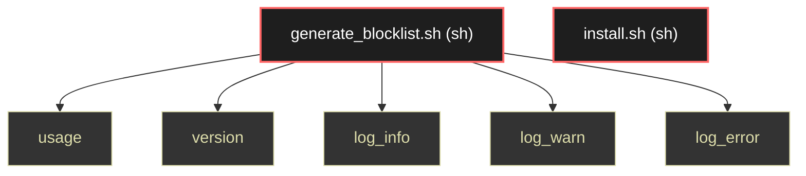

# Polyglot Codebase Knowledge Graph

> Generated offline by **readmenator**. 2 files, 15 symbols, 0 imports. Supports C, C++, Python, Go, Rust, JS/TS, Java, C#, Shell, PHP, Dart, GDScript, Nim, ASM, Ruby, Swift, Kotlin, Scala, Lua, Elixir.
> No LLMs. No tokens. Pure static analysis. See more [here](https://github.com/grisuno/ReadMenator)

**Start here:** Statistics Dashboard for scope, God Nodes for blast radius, Architecture Reference for per-file API. Agents: prefer `readmenator-agent/INDEX.md` + `SYMBOLS.md`.

**Wiki:** prefer `readmenator-wiki/index.md` for progressive disclosure: one synthesis page per community, `connections.json` with EXTRACTED vs INFERRED confidence, `queries.md` log, `REPORT.md` audit.

**Confidence:** EXTRACTED = parsed from source, INFERRED = heuristic bridge, AMBIGUOUS = reported, never hidden. See `readmenator-wiki/REPORT.md`.

**Total Files Parsed:** 2 | **Total Symbols Extracted:** 15 | **Total Imports:** 0

<!-- ranking_model: v1.0 | weights: {ppr:0.45,auth:0.2,test:0.15,doc:0.1,fresh:0.1} | alpha:0.85 | commit:05a4468 | date:2026-07-18 -->


## Table of Contents

1. [Statistics Dashboard](#statistics-dashboard)
2. [Architectural Layers](#architectural-layers)
3. [Ranked Context](#ranked-context)
4. [God Nodes](#god-nodes)
5. [Suggested Questions](#suggested-questions)
6. [Hotspot Analysis](#hotspot-analysis)
7. [Change Impact Analysis](#change-impact-analysis)
8. [Suggested Linting Rules](#suggested-linting-rules)
9. [Orphans](#orphans)
10. [Query Recipes](#query-recipes)
11. [Structural Knowledge Map](#structural-knowledge-map)
12. [UML Class Diagram](#uml-class-diagram)
13. [Code Property Graph](#code-property-graph)
14. [Architecture Reference](#architecture-reference)
    - [SH (2 files)](#sh-2-files)

---

## Statistics Dashboard

| Metric | Value |
|--------|-------|
| Total Files | 2 |
| Total Symbols | 15 |
| Total Imports | 0 |
| Call Edges | 0 |
| Inheritance Edges | 0 |
| Languages | 1 |
| Avg Symbols/File | 7.5 |
| Avg Imports/File | 0.0 |

---

## Architectural Layers

Auto-detected from path patterns, naming conventions, and imported frameworks.

| Layer | Files |
|-------|-------|
| utility | 2 |

### utility

- `generate_blocklist.sh` (sh, 15 symbols)
- `install.sh` (sh, 0 symbols)

---

## Ranked Context

Files ranked by composite score for the current query context. The ranking combines Personalized PageRank (query relevance), global authority, test coverage, documentation coverage, and code freshness. Model: v1.0.

| Rank | File | Composite | PPR | Authority | Test | Doc |
|------|------|-----------|-----|-----------|------|-----|
| 1 | `generate_blocklist.sh` | 0.0067 | 0.0000 | 0.0000 | 0.00 | 0.07 |
| 2 | `install.sh` | 0.0000 | 0.0000 | 0.0000 | 0.00 | 0.00 |

---

## God Nodes

Most architecturally central files ranked by combined import/export degree and symbol richness.

| File | Score | Connections | PageRank |
|------|-------|-------------|----------|
| `generate_blocklist.sh` | 1.5 | | 0.0000 |
| `install.sh` | 0.0 | | 0.0000 |

---

## Suggested Questions

Auto-generated exploration prompts based on graph structure:

- What does generate_blocklist.sh depend on, and what depends on it? (0 connections)
- What does install.sh depend on, and what depends on it? (0 connections)
- What is the overall architecture of this codebase?

---

## Hotspot Analysis

Files ranked by combined complexity (symbol count) and centrality (connection count). High-scoring files are architecturally critical and may need refactoring attention.

| File | Complexity | Centrality | Combined | Symbols | Connections |
|------|-----------|------------|----------|---------|-------------|
| `generate_blocklist.sh` | 1.000 | 0.000 | 0.400 | 15 | 0 |
| `install.sh` | 0.000 | 0.000 | 0.000 | 0 | 0 |

---

## Change Impact Analysis

Files sorted by how many other files would be affected if they changed. High-impact files should be changed with caution.

| File | Direct Dependents | Transitive Dependents | Total Impact |
|------|------------------|----------------------|--------------|
| `generate_blocklist.sh` | 0 | 0 | 0 |
| `install.sh` | 0 | 0 | 0 |

---

## Suggested Linting Rules

Automatically suggested linting and security rules based on patterns detected in the codebase. These can be exported as Semgrep rules using the `--export-rules` flag.

| Rule ID | Severity | Description | Language | Matches |
|---------|----------|-------------|----------|---------|
| `RM001` | info | Large number of functions in sh: 15 total | sh | 15 |

---

## Orphans

Files with no documentation or low connectivity. These are candidates for documentation investment or cleanup.

- `install.sh` (0 symbols, no doc)

---

## Query Recipes

Example queries you can run against this knowledge base using the ranking engine:

```
# Find files most relevant to a concept
readmenator query "Where is the import resolver implemented?"

# Rank files by relevance to a topic
readmenator query "How does documentation generation work?"

# Explain why a file ranks highly
readmenator query "explain readmenator/_documentation.py"

# Trace dependency paths with ranked context
readmenator query "path from CLI to exporter"
```

The ranking model uses the following signals:

- **Personalized PageRank** (45% weight): query-specific relevance via seed propagation
- **Global Authority** (20% weight): structural importance via standard PageRank
- **Test Coverage** (15% weight): fraction of symbols referenced in test files
- **Doc Coverage** (10% weight): presence of docstrings and file-level docs
- **Freshness** (10% weight): recent modification activity

Results include score decomposition and justification paths for each ranked item.

---

## Structural Knowledge Map



---

## Code Property Graph

Machine-readable Code Property Graph (CPG) in JSON-LD format. This block allows AI agents to parse the full structural graph without additional file reads. Compatible with GraphRAG pipelines.

```json
{"@context": "https://schema.org", "analysis": {"communities": [], "god_nodes": [{"node_id": "generate_blocklist.sh", "score": 1.5}, {"node_id": "install.sh", "score": 0.0}], "surprising_connections": []}, "edges": [], "generator": "readmenator", "metadata": {"edge_count": 0, "file_count": 2, "language_count": 1, "symbol_count": 15}, "nodes": [{"doc": "============================================================================= generate_blocklist.sh - Generate iptables blocklist from IP range file ============================================================================= Author: Gris Iscomeback Description: Converts IP range lists to iptables rules with flexible options Usage: ./generate_blocklist.sh [OPTIONS] <input_file> =============================================================================", "id": "generate_blocklist.sh", "kind": "module", "label": "generate_blocklist.sh", "language": "sh", "sha256": "97b3dfb44071dd06", "symbol_count": 15, "symbols": [{"kind": "function", "line": 42, "name": "usage"}, {"kind": "function", "line": 83, "name": "version"}, {"kind": "function", "line": 88, "name": "log_info"}, {"kind": "function", "line": 94, "name": "log_warn"}, {"kind": "function", "line": 98, "name": "log_error"}, {"kind": "function", "line": 102, "name": "check_root"}, {"kind": "function", "line": 111, "name": "validate_input_file"}, {"kind": "function", "line": 137, "name": "ip_to_int"}, {"kind": "function", "line": 145, "name": "int_to_ip"}, {"kind": "function", "line": 150, "name": "range_to_cidr"}, {"kind": "function", "line": 191, "name": "generate_iptables_script"}, {"kind": "function", "line": 320, "name": "interactive_mode"}, {"kind": "function", "line": 376, "name": "headless_mode"}, {"kind": "function", "line": 401, "name": "parse_arguments"}, {"kind": "function", "line": 467, "name": "main"}]}, {"id": "install.sh", "kind": "module", "label": "install.sh", "language": "sh", "sha256": "c907d80fd6734993", "symbol_count": 0, "symbols": []}], "type": "CodePropertyGraph", "version": "1.0"}
```

---

## Architecture Reference

### SH (2 files)

#### `generate_blocklist.sh`
**Path:** `generate_blocklist.sh`
**File Doc:** *============================================================================= generate_blocklist.sh - Generate iptables blocklist from IP range file ============================================================================= Author: Gris Iscomeback Description: Converts IP range lists to iptables rules with flexible options Usage: ./generate_blocklist.sh [OPTIONS] <input_file> =============================================================================*

**Functions:**
- `usage` (line 42)
- `version` (line 83)
- `log_info` (line 88)
- `log_warn` (line 94)
- `log_error` (line 98)
- `check_root` (line 102)
- `validate_input_file` (line 111)
- `ip_to_int` (line 137)
- `int_to_ip` (line 145)
- `range_to_cidr` (line 150)
- `generate_iptables_script` (line 191)
- `interactive_mode` (line 320)
- `headless_mode` (line 376)
- `parse_arguments` (line 401)
- `main` (line 467)

#### `install.sh`
**Path:** `install.sh`

*No symbols extracted*
